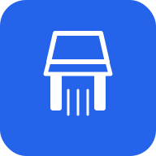
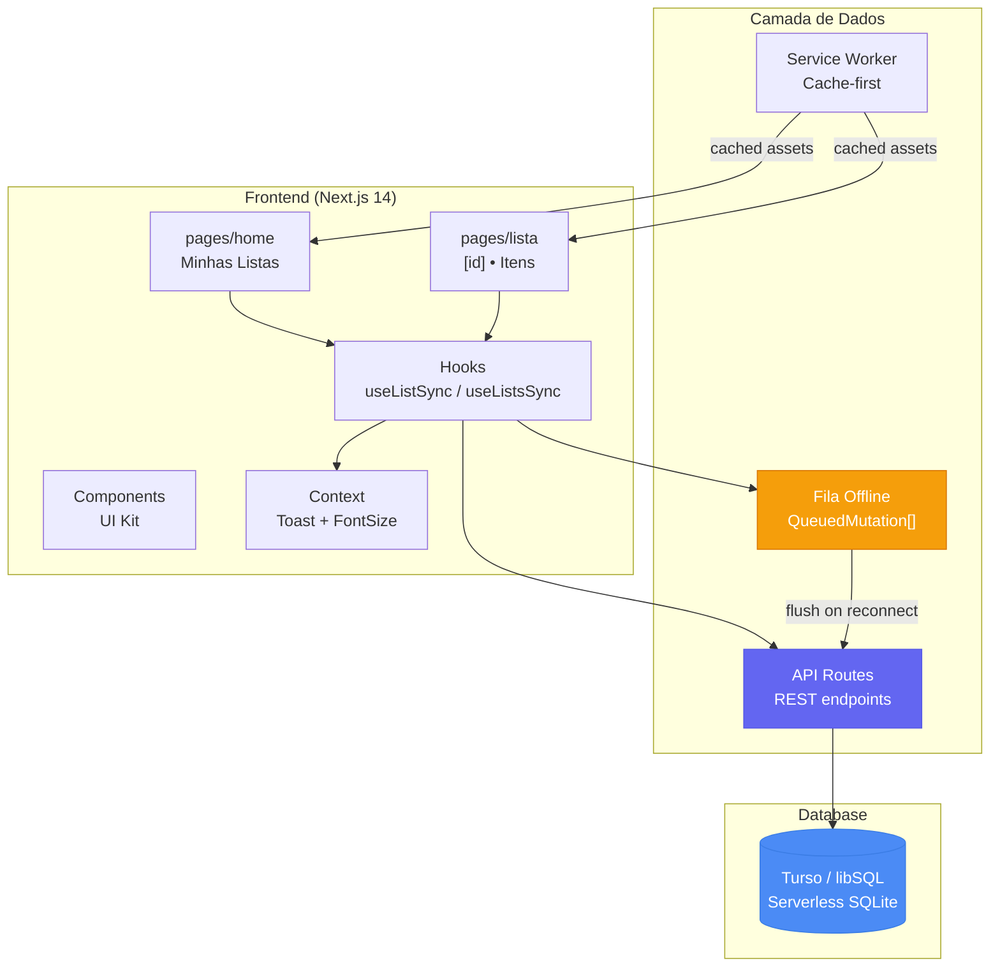
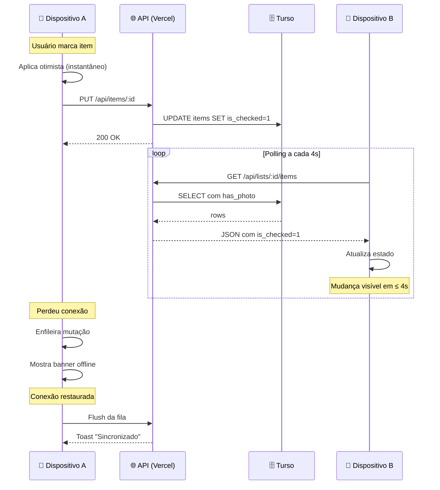

<p align="center">
  
</p>

<h1 align="center">🛒 Lista de Compras</h1>

<p align="center">
  <em>Aplicativo familiar de lista de compras com sincronização em tempo real</em>
</p>

<p align="center">
  <a href="#-sobre">Sobre</a>&nbsp;&nbsp;|&nbsp;&nbsp;
  <a href="#-funcionalidades">Funcionalidades</a>&nbsp;&nbsp;|&nbsp;&nbsp;
  <a href="#-arquitetura">Arquitetura</a>&nbsp;&nbsp;|&nbsp;&nbsp;
  <a href="#-tecnologias">Tecnologias</a>&nbsp;&nbsp;|&nbsp;&nbsp;
  <a href="#-como-executar">Como executar</a>&nbsp;&nbsp;|&nbsp;&nbsp;
  <a href="#-deploy">Deploy</a>&nbsp;&nbsp;|&nbsp;&nbsp;
  <a href="#-estrutura">Estrutura</a>
</p>

<p align="center">
  
  
  
  
  
  
  
  
</p>

<br />

## 📋 Sobre

**Lista de Compras** é um aplicativo PWA para famílias gerenciarem suas listas de supermercado em conjunto. Ele sincroniza as alterações **em tempo real** entre todos os dispositivos da família — enquanto uma pessoa adiciona itens em casa, outra já vê as mudanças no celular dentro do mercado.

<br />

## ✨ Funcionalidades

<table>
  <tbody>
    <tr>
      <td align="center" width="33%">
        <strong>⚡ Sincronização em tempo real</strong><br />
        <sub>Polling inteligente a cada 4s com pausa em background e refetch ao reconectar</sub>
      </td>
      <td align="center" width="33%">
        <strong>📱 PWA completo</strong><br />
        <sub>Instalável como app nativo no celular com Service Worker e cache offline</sub>
      </td>
      <td align="center" width="33%">
        <strong>🔌 Funciona offline</strong><br />
        <sub>Mutações otimistas com fila de reenvio automática quando a conexão voltar</sub>
      </td>
    </tr>
    <tr>
      <td align="center">
        <strong>📸 Foto por item</strong><br />
        <sub>Tire foto dos produtos para identificação — carregada sob demanda</sub>
      </td>
      <td align="center">
        <strong>🏷️ Modo promoção</strong><br />
        <sub>Marque itens em promoção com destaque visual</sub>
      </td>
      <td align="center">
        <strong>📊 Progresso visual</strong><br />
        <sub>Barra de progresso mostrando quantos itens já foram comprados</sub>
      </td>
    </tr>
    <tr>
      <td align="center">
        <strong>🔍 Busca de itens</strong><br />
        <sub>Campo de busca que aparece automaticamente com mais de 8 itens</sub>
      </td>
      <td align="center">
        <strong>🗑️ Limpar comprados</strong><br />
        <sub>Remova todos os itens comprados de uma vez com confirmação</sub>
      </td>
      <td align="center">
        <strong>♿ Acessibilidade</strong><br />
        <sub>Ajuste do tamanho da fonte em 4 níveis para melhor legibilidade</sub>
      </td>
    </tr>
  </tbody>
</table>

<br />

## 🏗️ Arquitetura



### 🔄 Fluxo de sincronização



<br />

## 🛠️ Tecnologias

| Categoria | Tecnologia |
|---|---|
| **Framework** | [Next.js 14](https://nextjs.org/) (App Router) |
| **Linguagem** | [TypeScript](https://www.typescriptlang.org/) 5.4+ |
| **Estilização** | [Tailwind CSS](https://tailwindcss.com/) 3.4+ |
| **Banco de dados** | [Turso](https://turso.tech/) (libSQL — SQLite serverless) |
| **Ícones** | [Lucide React](https://lucide.dev/) |
| **PWA** | Service Worker + Manifest + Cache API |
| **Hospedagem** | [Vercel](https://vercel.com/) (serverless) |

<br />

## 🚀 Como executar

### Pré-requisitos

- Node.js 18+
- Uma conta no [Turso](https://turso.tech/) (gratuita)

### Passo a passo

```bash
# 1. Clone o repositório
git clone https://github.com/LuisMarchio03/grocery-list.git
cd grocery-list

# 2. Instale as dependências
npm install

# 3. Configure o banco Turso
turso db create grocery-list
turso db show grocery-list --url    # copie a URL
turso db tokens create grocery-list # copie o token

# 4. Configure as variáveis de ambiente
cp .env.example .env.local
# Edite .env.local com suas credenciais do Turso

# 5. Inicie a aplicação
npm run dev
```

Acesse [http://localhost:3000](http://localhost:3000) 🎉

<br />

## 🌍 Deploy

### Deploy na Vercel

O deploy é totalmente automatizado com o Vercel:

[](https://vercel.com/new/clone?repository-url=https%3A%2F%2Fgithub.com%2FLuisMarchio03%2Fgrocery-list)

**Variáveis de ambiente obrigatórias no Vercel:**

| Variável | Descrição |
|---|---|
| `TURSO_DATABASE_URL` | URL de conexão do banco Turso |
| `TURSO_AUTH_TOKEN` | Token de autenticação do Turso |

```bash
# Ou faça deploy via CLI
npm i -g vercel
vercel --prod
```

### Schema do banco

Execute o script `schema.sql` no seu banco Turso:

```bash
turso db shell grocery-list < schema.sql
```

<br />

## 📁 Estrutura

```
📦 grocery-list
├── 📂 public                 # Assets estáticos
│   ├── 📂 icons              # Ícones PWA (192px, 512px)
│   ├── 📄 manifest.json      # Manifest do PWA
│   └── 📄 sw.js              # Service Worker
├── 📂 src
│   ├── 📂 app                # Next.js App Router
│   │   ├── 📂 api            # Rotas de API (REST)
│   │   │   ├── 📂 lists      # CRUD de listas
│   │   │   └── 📂 items      # CRUD de itens + foto
│   │   ├── 📂 lists/[id]     # Página de uma lista
│   │   ├── 📄 layout.tsx     # Layout global (PWA, metadados)
│   │   ├── 📄 page.tsx       # Home (minhas listas)
│   │   └── 📄 globals.css    # Estilos globais + animações
│   ├── 📂 components         # Componentes React
│   │   ├── 📄 AddItemForm    # Formulário de novo item
│   │   ├── 📄 ItemCard       # Card de item (check, foto, ações)
│   │   ├── 📄 PageHeader     # Cabeçalho com botão voltar
│   │   ├── 📄 SyncStatus     # Status de sincronização
│   │   ├── 📄 OfflineBanner  # Banner de modo offline
│   │   ├── 📄 ListProgress   # Barra de progresso
│   │   └── ...               # + componentes
│   └── 📂 lib                # Lógica e hooks
│       ├── 📂 sync           # Tipos, constantes, reconciliação
│       ├── 📄 db.ts          # Conexão com Turso
│       ├── 📄 useListSync    # Hook de sincronização de itens
│       ├── 📄 useListsSync   # Hook de sincronização de listas
│       └── ...
├── 📄 next.config.js         # Configuração Next.js
├── 📄 vercel.json            # Configuração Vercel
├── 📄 tailwind.config.ts     # Configuração Tailwind
├── 📄 tsconfig.json          # Configuração TypeScript
└── 📄 schema.sql             # Schema do banco de dados
```

<br />

## 📄 Licença

Este projeto está sob a licença MIT. Veja o arquivo [LICENSE](LICENSE) para mais detalhes.

---

<p align="center">
  Feito com ❤️ para a família<br />
  <sub>Repo: <code>grocery-list</code> · App: <strong>Lista de Compras</strong></sub>
</p>
